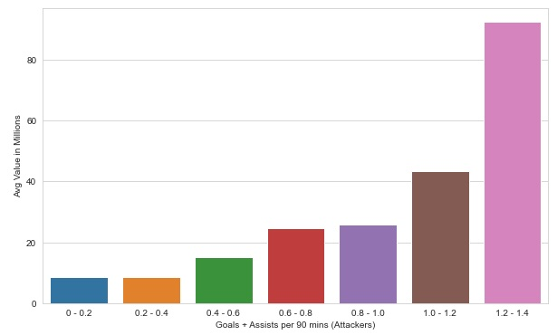
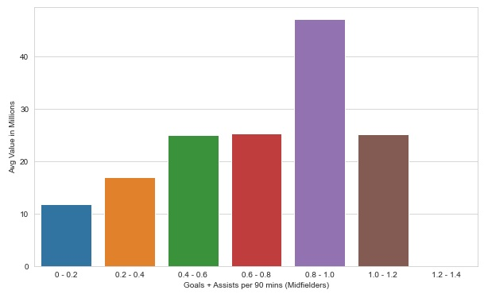

# Predicting a footballer's transfer price using his playing stats
Can a football player's value be deemed to be accurate/inflated/under-valued given his playing stats? There are obvious intangibles such as marketing benefits, merchandise sales, leadership qualities, personality, and so on to a player, but from a playing stats perspective only, there is a clear correlation between a player's stats and his transfer price.

Data from over 2k male professional football players from Europe's Top 5 Leagues (English Premier League, Italian Serie A, Spanish La Liga, German Bundesliga, and French Ligue 1) in the 2020/21 season was analyzed. The dataset is available for public download <a href="https://www.kaggle.com/sanjitva/predicting-soccer-player-transfer-values">here</a> 

Only players with a minimum of 15 matches played the previous season was taken into account (this reduced the dataset to 1680 professional footballers). While inflated transfer prices of celebrity players are well-known, most values in the dataset were in the 0 - 10 million bucket: 

There were clear correlations between transfer price of a player with some of the player's features: 

<b>1. AGE - younger players are deemed more valuable, suggesting a greater emphasis on potential v/s experience:</b>

<b>2. PLAYING POSITION - attacking players/goalscorers have a higher value attached to them:</b>

<b>3. LEAGUE - players in England's Premier League attract much higher prices than other leagues in Europe:</b>

<b>4. CONTRACT YEARS REMAINING - player's coming to the end of their existing contracts command lesser price than others: </b>

<b>5. GOAL SCORING ABILITY -  Irrespective of whether a player was classed as an attacker, midfielder, or defender, the ability to score goals increased his transfer price:</b>

Goals + Assists per 90 minutes among ATTACKERS

Goals + Assists per 90 minutes among MIDFIELDERS (there were just 6 midfielders with a goals+assist rate of > 0.8 which explains the skew below)

Goals + Assists per 90 minutes among DEFENDERS

There were over 140 stats describing a player and some of them were highly correlated with his transfer price. Here are the features with the strongest correlation (Pearson):

...while some other factors had much lower correlation with transfer price:

<b>PREDICTIVE MODEL</b>

Columns with little to no correlation with the transfer price of a player (such as his name and birth nation) were dropped from the dataset. A player's club was also initially dropped but including it led to a reduction in the RMSE of the results. This is possibly due to players from more famous clubs commanding higher values, all other things being equal. As a result, the 98 different clubs in the dataset were bucketed into 4 tiers, based on their mean transfer value (though this probably leads to some leakage). 

Data was standardized using MinMax Scaler as there were some large values in some coloumns. A linear regression model from Python's SciKit Learn library, using a 60-40 test-train split, was then run on the dataset. A plot of actual vs predicted values showed linear indications, suggesting that transfer values can be approximated using a player's playing stats:

A plot of Test Values - Predicted Values also showed most values to be centred around a minimum level which is a good result:

That said, the RMSE value was not satisfactory and some more feature engineering and column filtering is required to achieve a more accurate model. The explained variance score of 62% can be improved upon too. Specifically, the model did not perform well in predicting transfer values for high-value players as the predicted values were a fair bit different from the actuals, possibly due to the intangible factors mentioned earlier. However, for the most part transfer fees of a player using his playing stats can be predicted to some degree.

